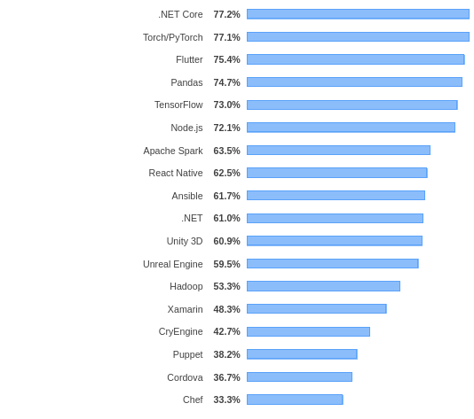
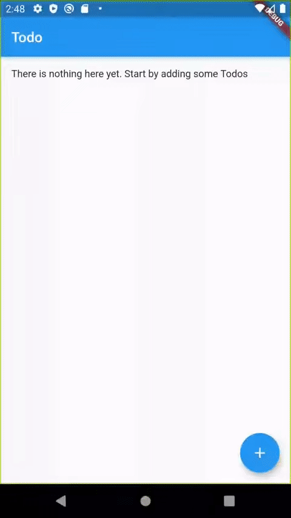

# Primer to Flutter

In this blog post, we will explore the basics of cross platform mobile application development using <a href="https://flutter.dev" target="_blank">flutter</a>, evaluate how it compares to existing cross platform solutions and create a simple TODO application to demonstrate how to quickly build apps with flutter.

## Brief introduction

Flutter is a free and open source UI toolkit for building natively compiled applications for mobile platforms like Android and iOS, and for the web and desktop as well. Some of the prominent features are native performance, single codebase for multiple platforms, quick development and a wide range of beautifully designed widgets.

Flutter apps are written in dart programming language, which is a very intuitive language with a C-like syntax. Dart is optimized for performance and developer friendliness. Apps written in dart can be as fast as native applications because dart code compiles down to machine instructions for ARM and x64 processors and to Javascript for the web platform. This, along with the <a href="https://github.com/flutter/engine" target="_blank">flutter engine</a>, makes flutter apps platform agnostic.

Another interesting dart feature used in flutter apps is the just-in-time (JIT) compiler, used during development and debugging, which powers the hot reload functionality, and the ahead-of-time (AOT) compiler which is used when building applications for the target platforms such as Android or iOS, resulting in native performance.

Everything composed on the screen with flutter is a widget including stuff like padding, alignment or opacity. The flutter engine draws and controls each pixel on the screen using it's own graphics engine called Skia. 

Flutter apps are truly native and hence offer great performance whereas apps built with react-native requires a javascript bridge to interact with OEM widgets. Flutter apps are much faster to develop because of a wide range of built-in widgets, good amount of documentation, hot reload and several other developer friendly choices made by Google while building Dart and Flutter. React Native on the other hand has the advantage of being older and hence has a large community of businesses and developers who have experience building react-native apps. It also has more third party libraries and packages as compared to flutter. The said, flutter is catching up and rapidly gaining moment as evident from Stackoverflow's 2019 developer survey where it scored 75.4% under "Most Loved Framework, Libraries and Tools".



All in all, flutter is great tool to have in our arsenal as mobile developers in 2020.

## Getting started with a sample application

Flutter's official docs are really well written and include getting started guides for different OS platforms, API documentation, widget catalogue along with several cookbooks and codelabs that one can follow along to learn more about flutter.

To get started with development, we will follow the official guide which is available here <a href="https://flutter.dev/docs/get-started/install" target="_blank">https://flutter.dev/docs/get-started/install</a>. Flutter requires flutter SDK as well as native build tools to be installed on the machine to begin development. To write apps, one may use Android Studios or VS Code. or any text editor can be used with flutter's command line tools, but a good rule of thumb is to install Android studios because it offers better support for management of android SDK, build tools and virtual devices. It also includes several built-in tools such as the icons and assets editor.

Once done with setup, we will start by creating a project. Open VS Code and create a new flutter project:


We should see the main file `main.dart` with some sample code (the counter application). We will start editing this file to create our TODO app.

Some of the features we will add to our TODO app:
  - Display a list of todo items
  - Mark todo items as completed
  - Add new item to the list

Let's start by creating a widget to hold our list of todo items. This is going to be a StatefulWidget which is a type of widget with some state. Flutter tracks changes to the state and redraws the widget when a new change in state is detected.

After creating the TodoList widget, our `main.dart` file looks like this:

```dart
/// imports widgets from the material design 
import 'package:flutter/material.dart';

void main() => runApp(MyApp());

/// Stateless widgets must implement the build() method and return a widget. 
/// The first parameter passed to build function is the context in which this widget is built
class MyApp extends StatelessWidget {
  @override
  Widget build(BuildContext context) {
    return MaterialApp(
      title: 'TODO',
      theme: ThemeData(
        primarySwatch: Colors.blue,
      ),
      home: TodoList(),
    );
  }
}

/// Stateful widgets must implement the createState method
/// State of a stateless widget against has a build() method with context
class TodoList extends StatefulWidget {
  @override
  State<StatefulWidget> createState() => TodoListState();
}

class TodoListState extends State<TodoList> {
  @override
  Widget build(BuildContext context) {
    return Scaffold(
      appBar: AppBar(
        title: Text('Todo'),
      ),
      body: Text('Todo List'),
    );
  }
}
```

The `MyApp` class here, extends Stateless widget i.e. a widget without any state whereas TodoList extends StatefulWidget. All flutter apps are a combination of these two types of widgets. StatelessWidgets must implement the `build()` method whereas Stateful widgets must implement the `createState()`.

Some built-in widgets used here are the `MaterialApp` widget, the `Scaffold` widget and AppBar and Text widgets. These are all imported from flutter's implementation of material design, available in the `material.dart` package. Similarly, to use native looking iOS widgets in applications, we can import widgets from the `flutter/cupertino.dart.` package.

Next, lets create a model class that represents an individual todo item. We will keep this simple i.e. only store label and completed status of the todo item. 

```dart
class Todo {
  final String label;
  bool completed;
  Todo(this.label, this.completed);
}
```

The constructor we wrote in the code above, is implemented using one of Dart's syntactic sugar to assign a constructor argument to instance variable. For more such interesting tidbits, take the dart <a target="_blank" href="https://dart.dev/guides/language/language-tour">language tour</a>.

Now lets modify the `TodoListState` class to store a list of Todo items in its state and also display it in a list. We will use `ListView.builder` to create a dynamic list of todo items. We will also use `Checkbox` and `Text` widget to display todo items.

```dart
/// State is composed all the variables declared in the State implementation of a Stateful widget
class TodoListState extends State<TodoList> {
  final List<Todo> todos = List<Todo>();
  @override
  Widget build(BuildContext context) {
    return Scaffold(
      appBar: AppBar(
        title: Text('Todo'),
      ),
      body: Padding(
        padding: EdgeInsets.all(16.0),
        child: todos.length > 0
            ? ListView.builder(
                itemCount: todos.length,
                itemBuilder: _buildRow,
              )
            : Text('There is nothing here yet. Start by adding some Todos'),
      ),
    );
  }

  /// build a single row of the list
  Widget _buildRow(context, index) => Row(
        children: <Widget>[
          Checkbox(
              value: todos[index].completed,
              onChanged: (value) => _changeTodo(index, value)),
          Text(todos[index].label,
              style: TextStyle(
                  decoration: todos[index].completed
                      ? TextDecoration.lineThrough
                      : null))
        ],
      );

  /// toggle the completed state of a todo item
  _changeTodo(int index, bool value) =>
      setState(() => todos[index].completed = value);
}
```

A few things to note here are: private functions start with an underscore, functions with a single line of body can be written using fat arrows (=>) and most importantly, to change the state of any variable contained in a Stateful widget, one must call the `setState` method.

The `ListView.builder` constructor allows us to work with very large lists since list items are created only when they are scroll over.

Another takeaway here is the fact that dart is such a intuitive language that it is quite easy to understand and start writing dart code immediately. 

Everything composed on a screen with flutter is a widget including stuff like padding, alignment and opacity. Notice in the the code above, we have used `Padding` as a widget that wraps the list or a text widget depending on the number of todo items. If there's nothing in the list, a text widget is displayed with some default message.

Also note how we haven't used `new` keyword when creating instances of a class, say `Text`. That's because using the `new` keyword is optional in dart and discouraged according to the <a href="https://dart.dev/guides/language/effective-dart/usage#dont-use-new">effective dart</a> guidelines.

## Running the application

At this point, lets run the code and see how the app looks on a device. Press F5, then select a virtual device and wait for the app to get installed. If you haven't created a virtual device yet, refer the <a href="https://flutter.dev/docs/get-started/install" target="_blank">getting started</a> guide.


Once the virtual device launches, we should see the following screen in a while. During development, the first launch always takes a while because the entire app gets built and installed on the virtual device but subsequent changes to code are instantly reflected on the device thanks to flutter's amazing hot reload feature. This reduces development time and also allows developers and designers to experiment more frequently with the interface changes.


As we can see, there are no todos here yet. Now lets add a floating action button that opens a dialog which we will use to add new todo items.

Adding the FAB is as easy as passing `floatingActionButton` parameter to the scaffold widget.

```dart
floatingActionButton: FloatingActionButton(
  child: Icon(Icons.add),                                /// uses the built-in icons
  onPressed: () => _promptDialog(context),
),
```

And declare a function inside `TodoListState` that displays a popup (AlertDialog) with a text input box. 

```dart
  /// display a dialog that accepts text
  _promptDialog(BuildContext context) {
    String _todoLabel = '';
    return showDialog(
        context: context,
        builder: (context) {
          return AlertDialog(
            title: Text('Enter TODO item'),
            content: TextField(
                onChanged: (value) => _todoLabel = value,
                decoration: InputDecoration(hintText: 'Add new TODO item')),
            actions: <Widget>[
              FlatButton(
                child: new Text('CANCEL'),
                onPressed: () => Navigator.of(context).pop(),
              ),
              FlatButton(
                child: new Text('ADD'),
                onPressed: () {
                  setState(() => todos.add(Todo(_todoLabel, false)));
                  /// dismisses the alert dialog
                  Navigator.of(context).pop();
                },
              )
            ],
          );
        });
  }

```

At this point, saving changes to the file should result in application getting updated on the virtual device so we can just click on the new floating action button, that appeared on the bottom right of the screen.

We used a few more built-in widgets here:

- AlertDialog: a dialog prompt that opens up when clicking on the FAB
- TextField: text input field for accepting user input
- InputDecoration: a widget that adds style to the input field
- FlatButton: a variation of button with no border or shadow
- FloatingActionButton: a floating icon button, used to trigger primary action on the screen

Here's a quick preview of how the application should looks:



And just like that, in less than 100 lines of code, we've built the user interface of a simple, cross platform todo application implemented in flutter.

The source code for this application is available at: <a href="https://github.com/androidfanatic/simple_todo_flutter" target="_blank">https://github.com/androidfanatic/simple_todo_flutter</a>

Some resources links to explore flutter further:

- <a href="https://flutter.dev/docs"  target="_blank">Flutter docs</a>
- <a href="https://pub.dev/" target="_blank">Dart packages</a>